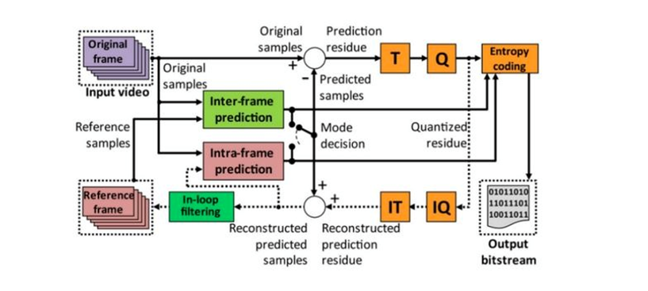

# Exercise Number 2 - Methods for Editing Spatial Intra Prediction

In the context of the "Transmission of Video and Audio Signals over the Internet 37121221" course, this exercise introduces spatial editing methods that underpin Intra Prediction compression. This readme document outlines the exercise workflow, incorporating images extracted from a pair of standard video films, implementation of the H.264 standard's Intra Prediction method, and data interpretation.

## Sources:
- [VCodex - H.264/AVC Intra Precision](https://www.vcodex.com/h264avc-intra-precision)
- Richardson, I. E. The H.264 Advanced Video Compression Standard. John Wiley & Sons, 2011.
- Kumar, Anil, et al. "Intra Prediction Algorithm for Video Frames of H.264." NVEO-NATURAL VOLATILES & ESSENTIAL OILS Journal| NVEO (2021): 11357-11367

## Program Implementation:

The implementation is carried out using Python and involves the following scripts:

- `DCTProcessor.py`: This script contains the DCTProcessor class which deals with the DCT (Discrete Cosine Transform) and IDCT (Inverse Discrete Cosine Transform) operations, as well as calculating metrics like PSNR (Peak Signal-to-Noise Ratio) and MAD (Mean Absolute Difference).

- `Encoder.py`: This script includes the Encoder class which implements the Intra Prediction method of the H.264 standard for 4x4 blocks. It deals with all the stages of the encoding process including fetching predictions, performing compression, and reconstructing the image.

- `main.py`: This is the main script which brings together all the elements. It includes the VideoProcessor class for handling video files and implements the functionality for the exercise including scanning directories, saving plots, counting modes, and processing videos.

## Execution Steps:

1. Two videos are selected, and one uncompressed Intensity (Luma) image is extracted from each video and saved as separate files. These images are represented below:

    
    

2. The Intra Prediction method of the H.264 standard for 4x4 blocks is implemented. This process includes all intra modes for 4x4 blocks, considers initial states when not all pixels of the frame are present, performs DCT transform, quantization, and inverse DCT transform.

    The residual image, the image after intra edits, and the restored image for each selected image and QP values of 6, 12, 18, and 30 are displayed below:

    - Bus CIF Frame:

        QP = 6
        

        QP = 12
        

        QP = 18
        

        QP = 30
        

    - Coastguard CIF Frame:

        QP = 6
        

        QP = 12
        

        QP = 18
        

        QP = 30
        

    The PS

NR between the original images and the reconstructed images is calculated and mentioned in the title of the restored image. The MAD is calculated and written next to the residual image.

3. For the two images and QP=12, a table tabulating the frequency of different modes is created. The number of sequences for each mode in each image is found and discussed in terms of how bitrate can be improved using the information that the current block mode is the same as the previous block's mode.

    For the Bus CIF Frame, the count of modes is as follows:

    ```
    13
    36
    391
    128
    120
    71
    90
    81
    155
    ```

    For the Coastguard CIF Frame, the count of modes is as follows:

    ```
    9
    0
    447
    242
    209
    25
    60
    56
    82
    ```

    

4. When dealing with a noisy image and Salt & Pepper type noise, SAD is used instead of MSE to characterize the noise.

    The given video encoder scheme, , has components where information is lost or changed. These components include the DCT transform, quantization, inverse DCT transform, and the Intra Prediction block.

    In the AVC (H.264) standard, intra coding can also be performed in blocks of 8x8 as well as 16x16. The parts of the image where these sizes have an advantage over 4x4 blocks include areas with less detail and where the texture or color changes slowly.