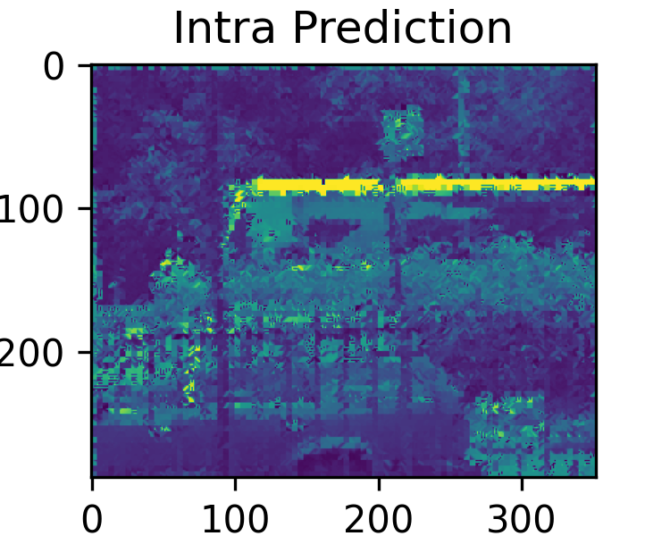
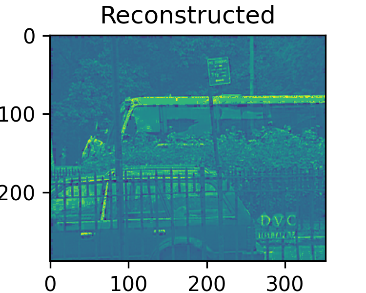
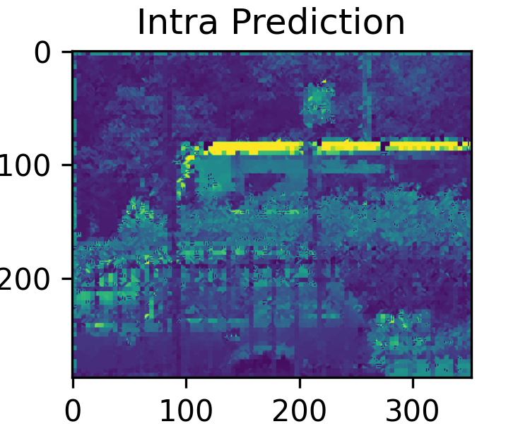
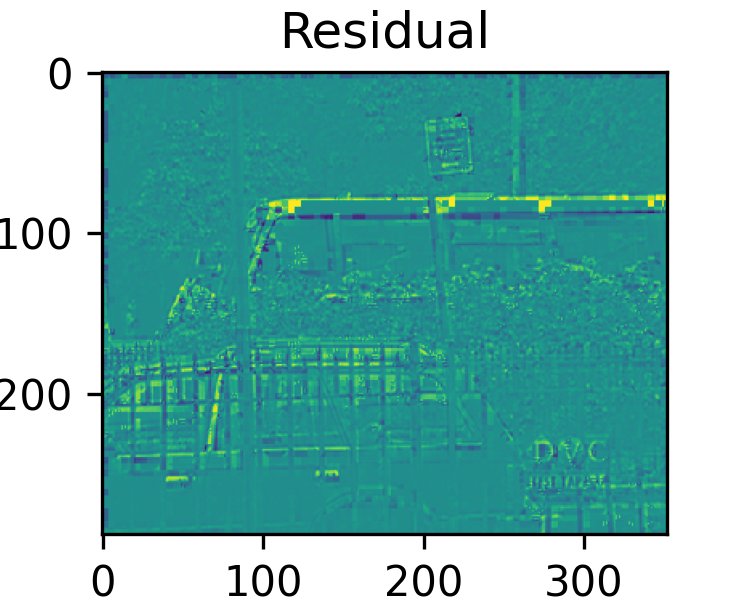
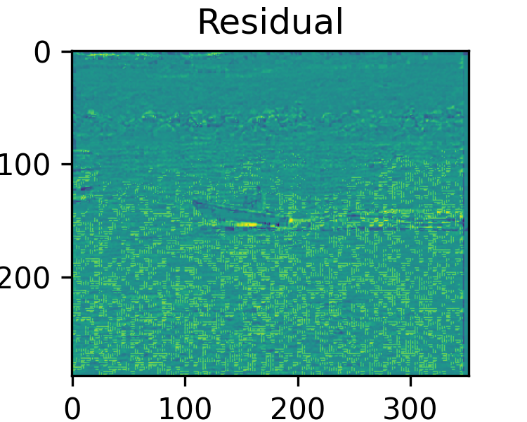
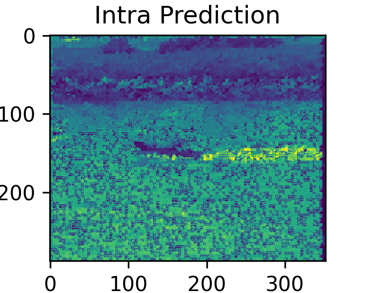
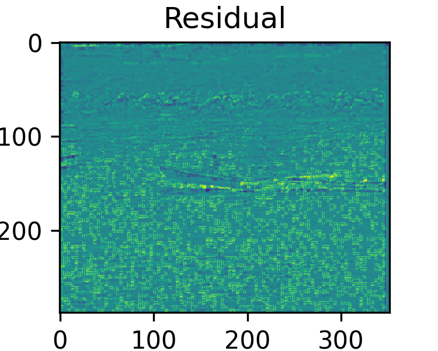
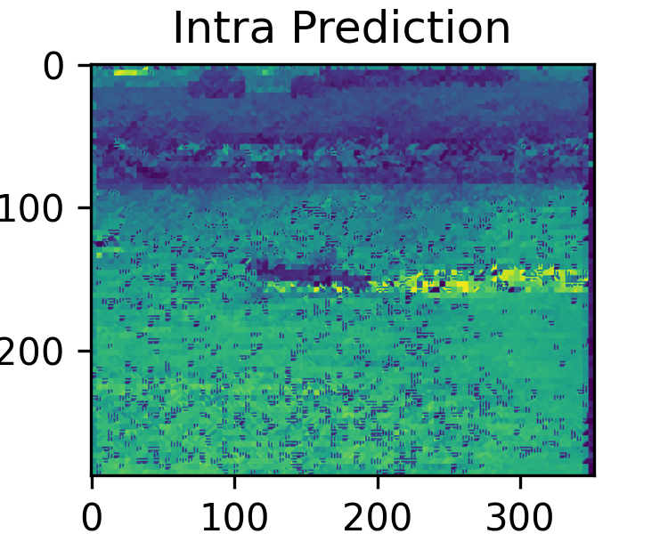
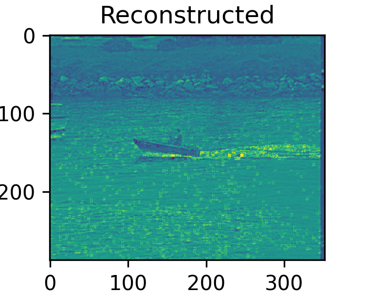
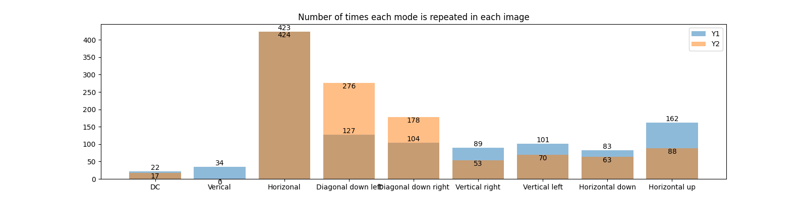

# Exercise Number 2 - Methods for Editing Spatial Intra Prediction

**By students: Uriel Manzur, Asaf Bar Shalom**

<!-- TOC -->
* [Exercise Number 2 - Methods for Editing Spatial Intra Prediction](#exercise-number-2---methods-for-editing-spatial-intra-prediction)
  * [Resources](#resources)
  * [Question 1](#question-1)
  * [Question 2](#question-2)
    * [Part a](#part-a)
    * [Part b](#part-b)
      * [bus_cif for QP=6](#buscif-for-qp6)
      * [bus_cif for QP=12](#buscif-for-qp12)
      * [bus_cif for QP=18](#buscif-for-qp18)
      * [bus_cif for QP=30](#buscif-for-qp30)
      * [coastguard_cif for QP=6](#coastguardcif-for-qp6)
      * [coastguard_cif for QP=12](#coastguardcif-for-qp12)
      * [coastguard_cif for QP=18](#coastguardcif-for-qp18)
      * [coastguard_cif for QP=30](#coastguardcif-for-qp30)
    * [Part c](#part-c)
  * [Question 3](#question-3)
    * [Part a](#part-a-1)
    * [Part b](#part-b-1)
  * [Question 4](#question-4)
    * [Part a](#part-a-2)
    * [Part b](#part-b-2)
    * [Part c](#part-c-1)
<!-- TOC -->

In the course "Transmission of Video and Audio Signals over the Internet 37121221," the purpose of this exercise is to learn about spatial editing methods that serve as the foundation for Intra Prediction compression.

## Resources
- Kumar, Anil, et al. "Intra Prediction Algorithm for Video Frames of H.264." NVEO-NATURAL VOLATILES & ESSENTIAL OILS Journal| NVEO (2021): 11357-11367

## Question 1
Two videos were selected for this exercise. From each video, one uncompressed Intensity (Luma) frame was extracted and saved as a separate file. This resulted in two uncompressed grayscale images:

|  |  |
| -------- | -------- |
|`bus_cif_frame.png` |`coastguard_cif_frame.png` |

## Question 2
### Part a
The intra prediction method of the H.264 standard was implemented for 4x4 blocks, as described in Kumar's article. The implementation takes into consideration all intra modes for 4x4 blocks, handles initial states when not all pixels of the frame are available, and performs DCT transform, quantization, and inverse DCT transform.

The Python files involved in this process include:
- `DCTProcessor.py`: Implements the DCTProcessor class for performing DCT, IDCT, quantization, dequantization, and error metrics calculations.
- `Encoder.py`: Defines the Encoder class for performing intra prediction, image compression, and reconstruction.
- `Decoder.py`: Implements the Decoder class for reconstructing the original image from the compressed format.
- `ImageProcessor.py`: Defines the ImageProcessor class for performing operations necessary for image compression and decompression.

The following diagram provides a detailed view of the intra prediction system:

The diagram shows the flow of the intra prediction system. It starts with the input of a 4x4 block from the original image. The prediction mode is determined based on the surrounding pixels and the prediction error is calculated. The error is then transformed, quantized, and entropy coded. The reverse process is applied for decoding to reconstruct the image block.

### Part b
For each image and for QP values of 6, 12, 18, and 30, the original image, the image after intra edits, the residual image, and the restored image were displayed. The PSNR (Peak Signal-to-Noise Ratio) between the original images and the reconstructed images were calculated and written in the title of the restored image.

Here are the outputs for each QP value:

#### bus_cif for QP=6

| |  |  | 
| -------- | -------- | -------- |

Image after Intra Prediction (PSNR: 15.8678967199016)

Residual Image (MAD: 23.567323626893938)

Reconstructed Image (PSNR: 15.93105662395991)

#### bus_cif for QP=12

|  |  |  |
| -------- | -------- | -------- |

Image after Intra Prediction (PSNR: 15.903162501820194)

Residual Image (MAD: 23.396987452651516)

Reconstructed Image (PSNR: 15.957074850399213)

#### bus_cif for QP=18

|  |  |  |
|--------------------------------------------------------------| -------- | -------- |

Image after Intra Prediction (PSNR: 15.977418884511106)

Residual Image (MAD: 23.353594539141415)

Reconstructed Image (PSNR: 16.033236427873593)

#### bus_cif for QP=30

| |  |  |
| -------- | -------- | -------- |

Image after Intra Prediction (PSNR: 15.906368019303583)

Residual Image (MAD: 24.754133128156564)

Reconstructed Image (PSNR: 15.715424508063888)

#### coastguard_cif for QP=6

|  |  |  |
| -------- | -------- |------------------------------------------------------------------------------------------|

Image after Intra Prediction (PSNR: 13.32573027618592)

Residual Image (MAD: 33.1395202020202)

Reconstructed Image (PSNR: 13.395374389266703)

#### coastguard_cif for QP=12

|  |  |  |
| -------- | -------- | -------- |

Image after Intra Prediction (PSNR: 13.374872829939822)

Residual Image (MAD: 32.91103416982323)

Reconstructed Image (PSNR: 13.433505651748172)

#### coastguard_cif for QP=18

|   |  |   |
|-----------------------------------------------------------------------------|---|---|

Image after Intra Prediction (PSNR: 13.554844292332792)

Residual Image (MAD: 32.12626262626262)

Reconstructed Image (PSNR: 13.5891768492349)

#### coastguard_cif for QP=30
|  |  |   |
|----------------------------------------------------------------------------|----------------------------------------------------------------------------------|---|

Image after Intra Prediction (PSNR: 15.733535861495584)

Residual Image (MAD: 25.792771464646464)

Reconstructed Image (PSNR: 15.392424799537515)

Each of these sets of images provides valuable insights into the effects of the intra prediction, the residuals left after prediction, and the quality of the reconstructed image compared to the original, for different Quantization Parameters (QP).

### Part c
The Mean Absolute Difference (MAD) obtained from the process of searching for the best modes was calculated and displayed next to the residual image.

## Question 3
### Part a
For the two images and QP=12, a table was created to tabulate the frequency of different modes. The frequency of each mode used for the `bus_c
if` and `coastguard_cif` images was analyzed.

For each image, the modes and their counts are as follows:

|   |  `bus_cif` | `coastguard_cif` |
|---|---|------------------|
|  DC |  13 | 9                |
| Vertical  | 36  | 0                |
|  Horizontal |   391| 447              |
|   Diagonal down left| 128  | 242              |
|  Diagonal down right |  120 | 209              |
| Vertical right  |  71 | 25               |
| Vertical left  | 90  | 60               |
|  Horizontal down | 81  | 56               |
|  Horizontal up |  155 | 82               |

The results were visualized using bar charts to compare the frequency of each mode between the two images:

### Part b
The pattern of the current block mode being the same as the previous one can be used to avoid the need to send the mode information repeatedly, thus saving bits. This technique can be particularly effective in areas of the image where the same mode is used repeatedly over a series of blocks.

## Question 4
### Part a
When dealing with a noisy image and Salt & Pepper type noise, it is preferable to use SAD (Sum of Absolute Differences) instead of MSE (Mean Squared Error) to characterize the noise.

Salt & Pepper noise is a type of noise often seen in images, where pixels in the image are very different in color or intensity from their surrounding pixels. This noise presents itself as sparsely occurring white and black pixels, hence the name "Salt & Pepper".

When dealing with this type of noise, the Sum of Absolute Differences (SAD) is often preferred over the Mean Squared Error (MSE) for a few reasons:

1. **Outlier Sensitivity**: MSE is sensitive to outliers because it squares the differences. In the case of Salt & Pepper noise, where the noise can be seen as outliers, this can lead to a large error. On the other hand, SAD, which is based on absolute differences, is less sensitive to these outliers.

2. **Computational Simplicity**: SAD is computationally simpler than MSE as it avoids the need for squaring and square root operations. This can be an advantage in real-time applications where computational resources and speed are critical.

3. **Perceptual Relevance**: In some cases, SAD can be more perceptually relevant than MSE. Human visual system is more sensitive to absolute differences in intensities rather than squared differences, especially for high contrast changes like those caused by Salt & Pepper noise.

Therefore, while both SAD and MSE can be used to characterize noise, SAD is often a better choice when dealing with Salt & Pepper noise.

### Part b
Given a typical hybrid video encoder scheme as shown in the provided image, the components of the system where information is lost or changed include:

1) Intra Prediction: This block processes type I frames, i.e., frames that are encoded without reference to any other frame. During intra prediction, certain assumptions are made to predict pixel values in the frame, leading to a loss of information as the prediction is not always accurate.

2) Inter Prediction: Inter prediction involves the estimation of motion vectors, which can lead to changes in the image information. The motion estimation process is not ideal and depends on several parameters, leading to potential inaccuracies.

3) Quantization: The quantization process in video encoding involves rounding off certain low-value components to reduce data size, resulting in a loss of information. The discarded values, which are usually smaller details in the image, cannot be recovered after quantization.

The above-mentioned steps are inherent to the video compression process, and they aim to reduce data size at the cost of some loss in quality. Understanding these losses helps us to design better encoding algorithms and tune parameters to achieve a good balance between data size and image quality.

### Part c

In the AVC (H.264) standard, intra coding can be performed in blocks of different sizes: 4x4, 8x8, and 16x16. The choice of block size can have a significant impact on the efficiency of the encoding process and the quality of the resulting image.

The advantage of using larger block sizes, such as 8x8 or 16x16, over 4x4 blocks typically becomes apparent in certain parts of the image:

1. **Homogeneous Areas**: These are areas of the image with little variation in color or intensity. In such areas, a larger block size can effectively capture the uniformity, resulting in more efficient encoding. For example, a clear blue sky or a white wall would benefit from larger block sizes.

2. **Low-Detail Regions**: In regions of the image where there isn't a lot of detail or high-frequency content (like edges or texture), larger block sizes can be more efficient. This is because they can capture the broader patterns without wasting bits on unnecessary detail.

In contrast, smaller block sizes like 4x4 are more advantageous in high-detail or high-contrast areas of the image, where they can better capture the intricate details and variations.

Therefore, the choice of block size in intra coding should ideally be adaptive, taking into account the characteristics of the different regions within the image. This adaptability is one of the strengths of the AVC (H.264) standard, allowing it to maintain a good balance between compression efficiency and image quality.

In conclusion, through this exercise, we have deepened our understanding of the intra prediction method used in the H.264 video compression standard. The detailed analysis, implementation, and use of Python for programming and image processing has helped us appreciate the intricate balance between data compression and maintaining image quality.