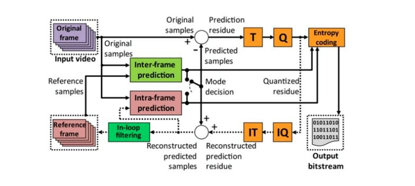

# Exercise Number 2 - Methods for Editing Spatial Intra Prediction

In the course "Transmission of Video and Audio Signals over the Internet 37121221," the purpose of this exercise is to learn about spatial editing methods that serve as the foundation for Intra Prediction compression.

Sources:
- https://www.vcodex.com/h264avc-intra-precision
- Richardson, I. E. The H.264 Advanced Video Compression Standard. John Wiley & Sons, 2011.
- Kumar, Anil, et al. "Intra Prediction Algorithm for Video Frames of H.264." NVEO-NATURAL VOLATILES & ESSENTIAL OILS Journal| NVEO (2021): 11357-11367

1. Select two videos from the previous exercise. Extract one uncompressed Intensity (Luma) image from each video and save them as separate files. This will provide two uncompressed grayscale images from the standard video films used for developing video compression algorithms.

2. a. Read Kumar's article and implement the Intra Prediction method of the H.264 standard for 4x4 blocks. The implementation should include all intra modes for 4x4 blocks, consider the initial states when not all pixels of the frame are present, perform DCT transform, quantization, and inverse DCT transform. Document the computer program that performs the compression effectively.

   b. For each selected image and QP values of 6, 12, 18, and 30, display the original image, the image after intra edits, the residual image, and the restored image.

   Calculate the PSNR between the original images and the reconstructed images. Write the appropriate PSNR value in the title of the restored image.

   c. Calculate the MAD (Mean Absolute Difference) that can be extracted from the process of searching for the best modes, and write it next to the residual image.

3. a. For the two images and QP=12, create a table tabulating the frequency of different modes.

   b. Find the number of sequences for each mode in each image. Discuss how bitrate can be improved using the information that the current block mode is the same as the previous block's mode.

4. a. When dealing with a noisy image and Salt & Pepper type noise, it is preferable to use SAD (Sum of Absolute Differences) instead of MSE (Mean Squared Error) to characterize the noise.

   b. Given a video encoder scheme,  identify the components of the system where information is lost or changed.

   c. In the AVC (H.264) standard, intra coding can also be performed in blocks of 8x8 as well as 16x16. Identify the parts of the image where these sizes have an advantage over 4x4 blocks.